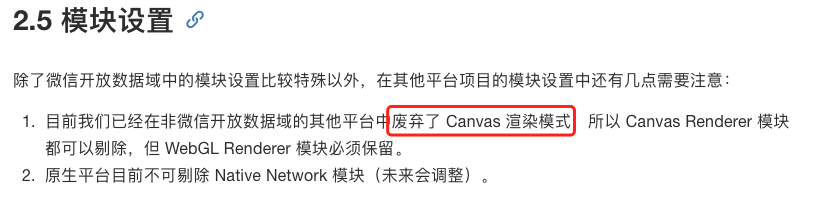
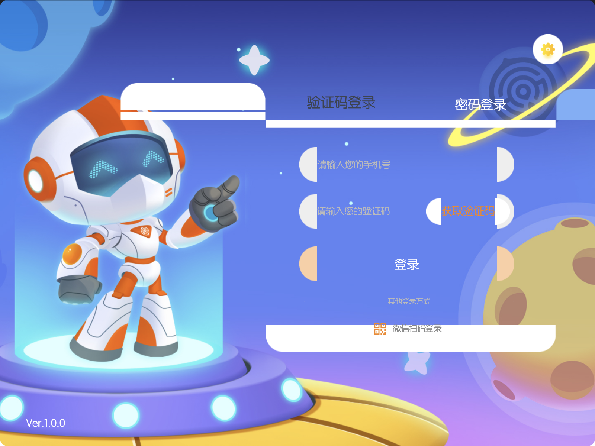
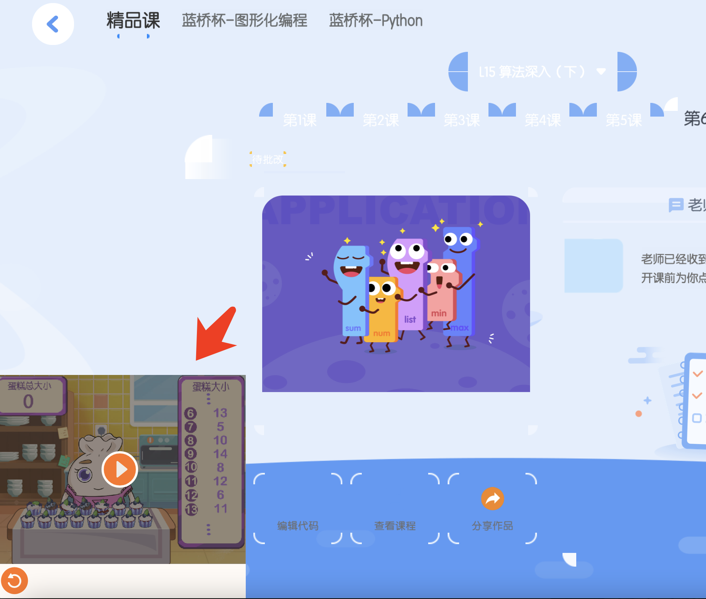
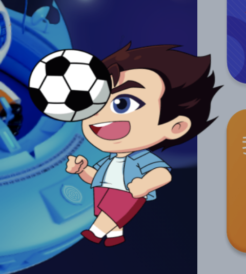
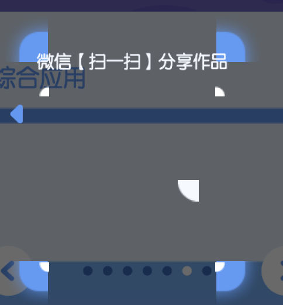
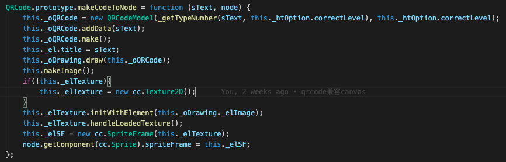
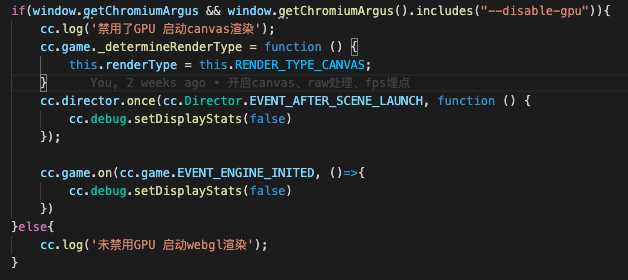
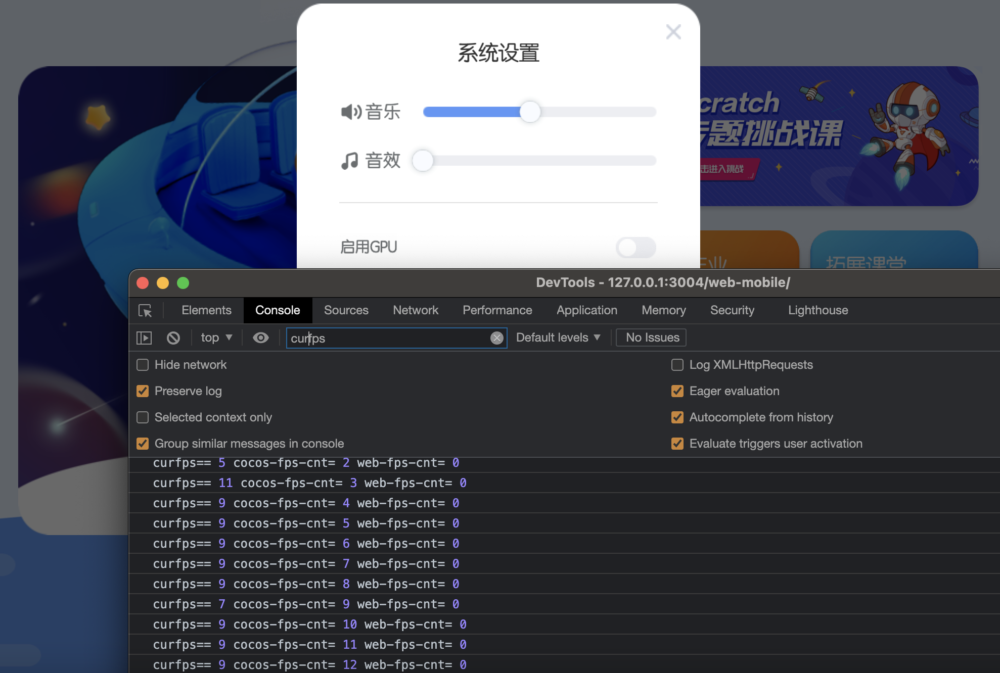
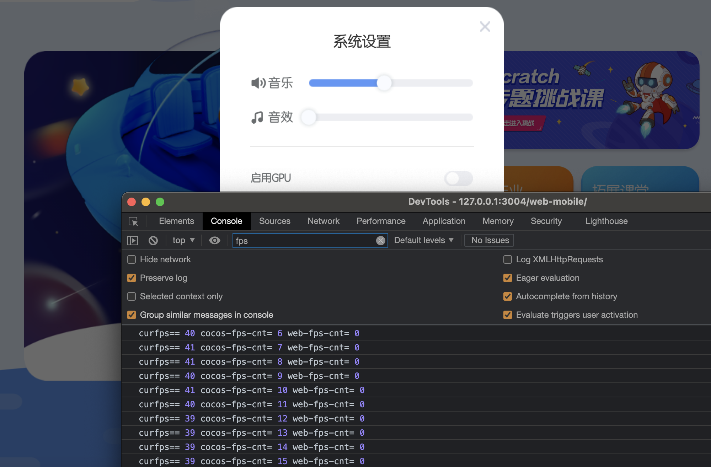
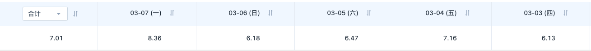

<!--
 * @Author: 宋新亮
 * @Date: 2022-05-27 13:02:00
 * @email: song.jobmail@gmail.com
-->
## Situation

用户因无法启用webgl等原因关闭GPU后 CPU负载过高 界面显示卡顿 如果改为canvas渲染 能显著提升FPS

## Task

Cocos Creator在v1.0中支持webgl和canvas两种渲染模式，但是在2.0版本引擎代码大部分重写后废弃了canvas渲染。

经调研，ccc2.x引入了effect和material两个资源去处理之前blendFunc(颜色混合模式)，所有的派生自RenderComponent的渲染类组件都会使用这两个资源，判断若为canvas渲染模式下，则相应代码不生效。

Cocos Creator底层支持canvas渲染的常规组件有label，sprite，这两个组件会判断渲染模式进行处理，但是如果要用到类似图片置灰等情况，可能无法进行了，如果要使用mask和graphics组件，某些例如mask的Alpha 阈值、反向遮罩等功能也是不支持使用的，camera功能也是基于webgl的，不支持canvas渲染模式。

对于我们的项目，强制启用canvas渲染界面后目前的异常有：

* 九宫格显示异常

* 部分图片坐标位置偏移，BMFont字体无法显示

* webview位置无法改变

* 图片被拉伸变形

* 二维码无法显示

## Action

1、首先处理的是图片坐标不对的问题，经对比发现，所有坐标有问题的图都是修改了锚点（比如 需要沿图片某一特定点做旋转动画）的， 而在新建的demo中修改锚点开启canvas后并没有坐标位置偏移问题，进一步观察发现，有问题的图都在合图中被旋转了，并且那些无法显示的bmfont字体均在合图中被旋转了。总结，在canvas渲染器上，图集的旋转与节点的旋转存在冲突，当需要修改锚点时，不能开启合图旋转。所以，禁掉合图中的旋转可以规避canvas模式下设置锚点失效导致坐标偏移的问题。

2、第二个处理的问题，是webview组件设置坐标不生效，webview组件始终显示在左下角。经与cocos官方研发人员沟通，同步底层CCamera中的webgl方法给canvas后webview组件正常显示。但在ccc编辑器中组件投影跟随鼠标移动有点问题，不影响用户。

3、第三个处理的问题，是部分图片被拉伸变形。观察发现，走形图片在设置中都取消了trim，trim的功能是去除节点约束框内的透明区域，底层默认开启trim。但在某些场景下（比如帧动画、头像框等）不能去除透明区域。在canvas模式下不开启trim，界面没有显示透明区域而是让图片拉伸占满透明区域。经与cocos官方研发人员沟通，修改canvas模式下sprite的simple.js中矩阵变换计算公式解决了Size Mode为raw(取原始图片未裁切的尺寸)模式下的图片拉伸问题。但如果想要自定义尺寸，则设置的宽高不生效。目前客户端这种场景较少，可以暂时用缩放来解决这个问题，但缩放的前提是要保证网络资源上传的规范。

4、第四个解决的问题，是二维码无法显示的问题。原二维码是使用ccc的Graphics组件完成，而ccc在canvas模式下是不支持Graphics组件的，所以只能通过sprite方式来绘制。更新了qrcode插件后，经过对qrcode.js的研究，我在插件中封装了如下代码，实现了传入ccc的node后直接生成二维码并展示在node上。

5、第五个解决的问题，是九宫格问题。在ccc1.x版本上是支持canvas渲染的，但是当时的版本九宫格也是有显示问题的，即在canvas模式下无法对0像素进行拉伸。所以我在项目中检索设置了0像素九宫格的meta文件改为了1像素。设置1像素后客户端上的九宫格图片大部分显示正常了。那些不正常的部分，表现为在设置拉伸的位置出现了一条黑线，如下图。经分析，出现黑线的原因有两种：第一种（下图标号1），为合图旋转所致，禁止旋转后正常；第二种（下图标号2、3），是当设置的高/宽与原图的高/宽相等时，中间也会出现一道黑线，所以当设置等高/宽的时候，图片不能设置高/宽向的九宫格。

6、根据GPU状态开启不同的渲染模式

7、设置帧率为30

8、fps埋点上传方便对比数据

## Result

以上所做的，包括ccc的引擎代码改动、插件封装、合图设置、九宫格设置、资源替换等都能兼容canvas和webgl两种模式，无须单独维护版本。

禁用gpu后webgl渲染：

禁用gpu后canvas渲染：

如上对比图，fps提升四倍左右。

fps低帧（<20）比率约为7%
