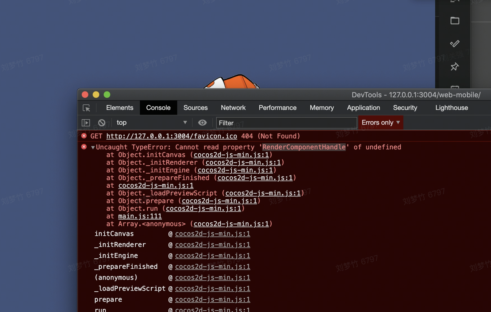
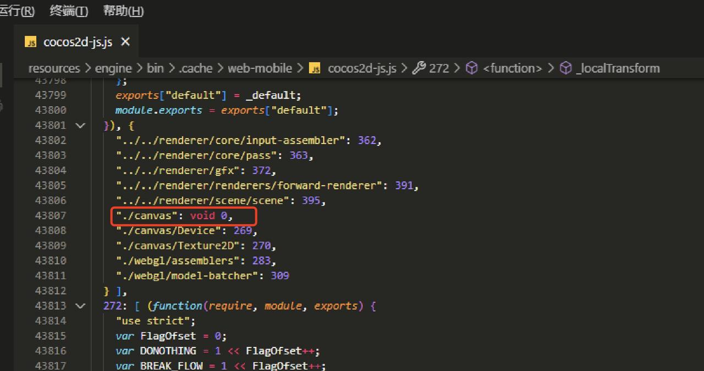
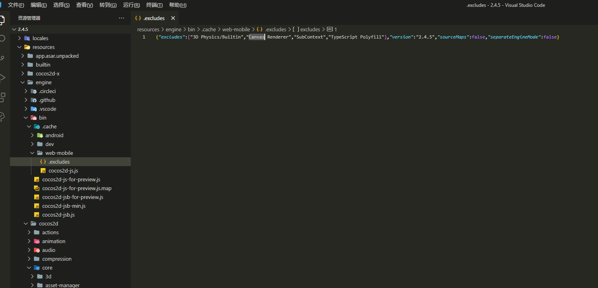
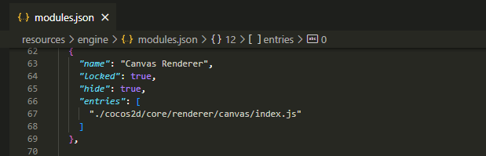
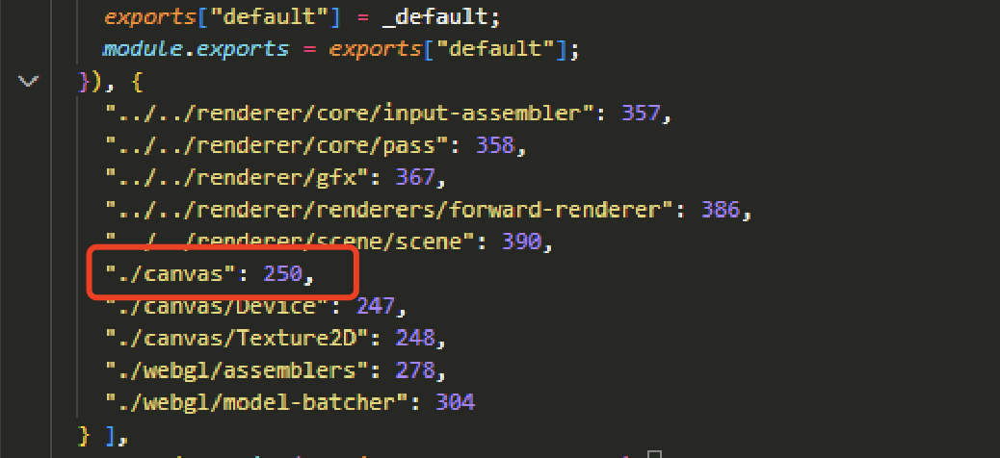
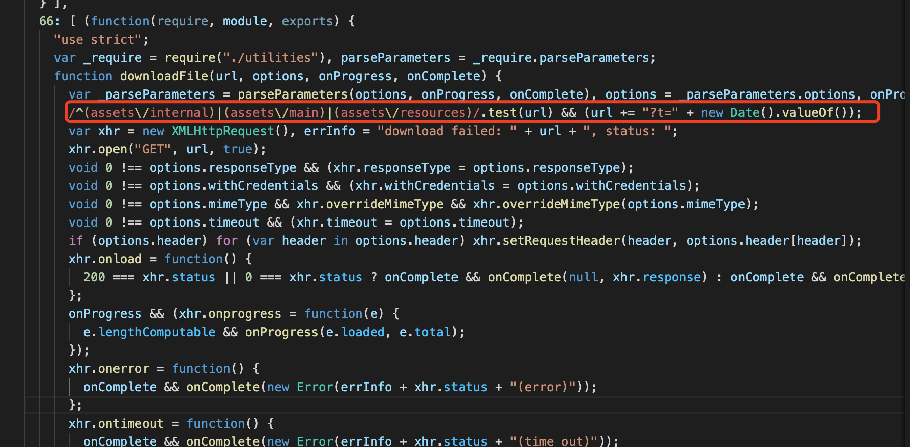

CocosCreator 升级v2.4.5引擎修改
## Situation
因其他项目组接过莫顿系统，使用的v2.4.5的CocosCreator，移植莫顿系统到我们的客户端内需要将我们的ccc升级到v2.4.5。因关闭GPU后wegbl渲染卡顿问题，所以需要使用canvas渲染，而v2.4.5的ccc不支持canvas渲染。

## Task
解决v2.4.5 cocos2d-js-min.js报错，无法启动客户端

除此之外，之前我在v2.2.2的ccc中修复了一版canvas渲染的引擎bug，因为cocos官方已经弃用了canvas渲染，在引擎的版本迭代中不会再优化任何canvas的代码，所以升级为v2.4.5的ccc后需要再修复一遍canvas渲染的bug。

## Action
改动一：
根据报错'RenderComponentHandle' undefined 发现打好包的引擎文件中没有关于canvas渲染的所有方法，进一步看是没有把canvas模块打进去

去引擎代码里验证，进一步发现打包引擎时底层代码exclude Canvas Renderer模块了

在微信群和官方论坛提问如何再次引入canvas renderer未得到回复。最终在引擎代码中查找到modules.json，删除其中canvas renderer的对象后清空.cache 重新生成cocos2d-js.js，新引擎文件中引入了canvas渲染

改动二：
验证canvas渲染生效后，再参考之前在v2.2.2改过的COCOS 兼容模式修改文档  改一遍v2.4.5的引擎代码。

改动三：
除上述外，两三年前出现过客户端加载资源缓存的问题导致客户端报错找不到资源，所以修改了引擎代码，在加载本地资源时加上了时间戳。因2.2版本到2.4版本引擎对资源加载的改动较大，所以重新梳理了2.4版本的资源加载，在如下图增加时间戳。

## Result
1、实现了CocosCreator v2.4.5 在客户端禁用GPU时使用canvas渲染

2、解决了v2.4.5的引擎下canvas渲染的bug，效果如COCOS 兼容模式修改文档  之Result

3、v2.4.5引擎加载本地资源时禁止走缓存，使维持最新文件
